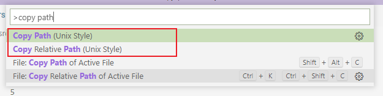
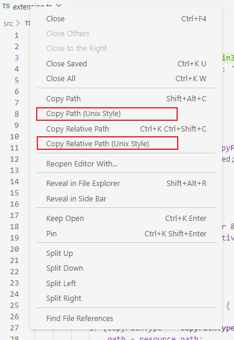
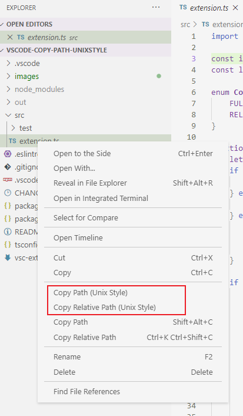

# Copy Path (Unix Style)

Copy Windows paths to clipboard to work in R programming Language.

## Features

Adds commands to copy the active file path and file relative paths in Unix style

- Copy Path (Unix Style): `C:/chris/project-name/src/extension.ts`
- Copy Relative Path (Unix Style): `src/extension.ts`

### Command Palette

### Editor Title Context Menu

### Explorer Context Menu

)

## Acknowledgements
Extension modified from following extension
 - https://github.com/baincd/vscode-copy-path-unixstyle (Copy Path (Unix Style))
